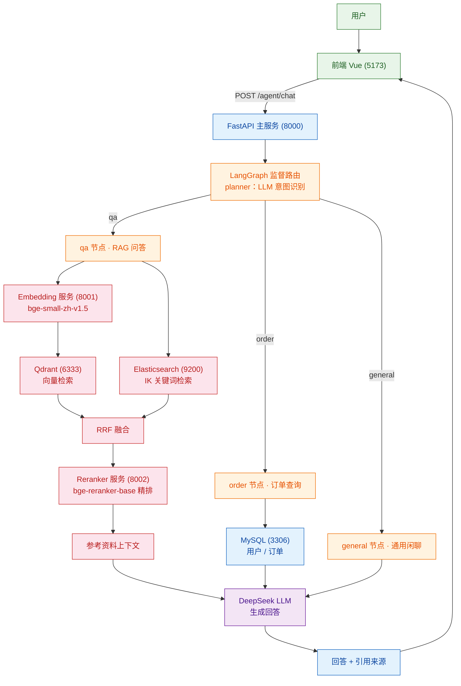
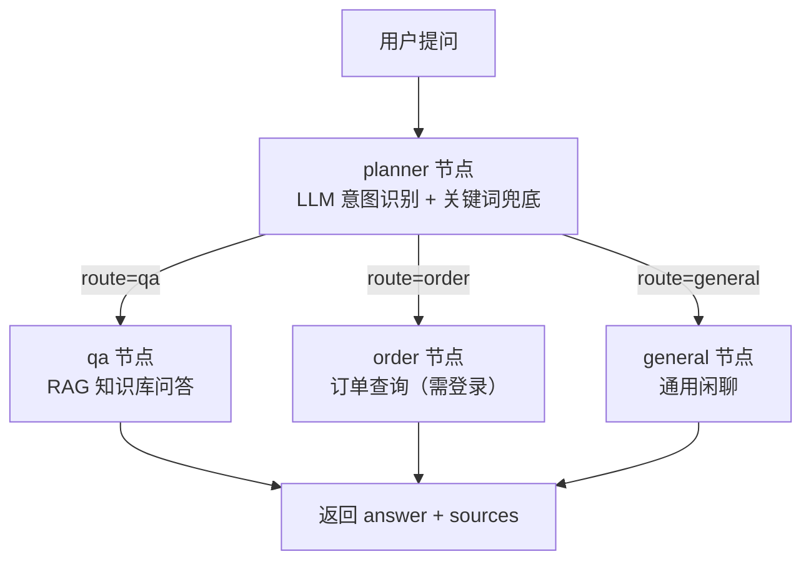

# AI 智能客服（客诉服务台）

基于 RAG + LangGraph 的电商智能客服演示系统：知识库问答、订单查询、通用闲聊，由监督式路由自动分发。

> ⚠️ 本项目为演示/教学用途：**登录为简单模拟**，仅用于演示「登录后查询订单」，并非真实鉴权系统。密码在数据库中为明文存储，`/agent/chat` 信任客户端传入的 `user_id`。**请勿直接用于生产环境。**

## 架构

```
前端 Vue3+Vite (5173)
   │  /agent /login /knowledge /rag (vite proxy)
   ▼
FastAPI 主服务 (8000)  ── LangGraph Supervisor ──┬─ qa 节点（RAG 问答）
   │                                            ├─ order 节点（订单查询）
   │                                            └─ general 节点（通用闲聊）
   │
   ├─ MySQL 8 (3306)  用户 / 订单
   ├─ Elasticsearch 8.19+IK (9200)  关键词检索
   ├─ Qdrant (6333)   向量检索（bge-small-zh-v1.5, 512 维）
   └─ 模型服务：
        ├─ Embedding (8001)  bge-small-zh-v1.5
        └─ Reranker  (8002)  bge-reranker-base
```

检索链路：Qdrant 向量召回 + ES 关键词召回 → RRF 融合 → BGE-Reranker 精排 → 作为上下文交给 LLM（DeepSeek API）。

## 运行流程

用户提问从进入系统到返回回答的完整链路：



监督路由的决策分支：



> Mermaid 图在 GitHub 上可直接渲染；本地编辑器若未启用 Mermaid 插件，可在 https://mermaid.live 粘贴预览。

## 目录结构

```
app/
  api/          路由、请求模型、实体、dependencies、模型服务 lifespan
  agent/        监督路由图、qa/order/general 子代理、会话记忆
  client/       ES / Qdrant / MySQL / Embedding / Reranker 客户端
  repository/   数据访问层
  service/      业务层（检索、知识库入库、订单、登录）
  core/         文本抽取与分块（FAQ / 条款 / 行 / 默认）
  conf/         配置加载（OmegaConf + dataclass）
conf/app_config.yaml   运行配置（端口、索引名、数据库连接等）
data/          知识库样例文档（faq.txt / product_info.docx / policy.pdf）
docker/        docker-compose（ES+IK / Qdrant / MySQL）
frontend/      Vue3 前端
```

## 环境要求

- Python >= 3.10（推荐 3.12，已用 uv 管理）
- Node.js + npm（前端）
- Docker Desktop（ES / Qdrant / MySQL）
- 本地 GPU/CPU 可跑 bge-small-zh-v1.5 与 bge-reranker-base（CPU 可运行，速度较慢）

### 模型文件

模型目录（`docker/embedding/`、`docker/reranker/`）不随仓库提交，首次使用前请从 HuggingFace 下载到对应路径：

```bash
# bge-small-zh-v1.5 -> docker/embedding/bge-small-zh-v1.5/
git lfs clone https://huggingface.co/BAAI/bge-small-zh-v1.5

# bge-reranker-base -> docker/reranker/bge-reranker-base/
git lfs clone https://huggingface.co/BAAI/bge-reranker-base
```

应用启动时会从 `docker/embedding/...`、`docker/reranker/...` 读取本地模型（见 `app/conf/embedding.py`、`app/conf/reranker.py`）。

## 启动步骤

### 1. 配置密钥

复制/填写 `.env`（已加入 `.gitignore`，不会提交）：

```
LLM_API_KEY=你的 DeepSeek API Key
```

> 当前仓库中的 `.env` 曾是真实 Key，**请到 DeepSeek 平台轮换后重新填入**，避免被盗用产生费用。

### 2. 启动基础存储（Docker）

```bash
cd docker
docker compose up -d
```

`docker-compose.yml` 默认账号 `root/root`、库名 `ai_cs`，与 `conf/app_config.yaml` 一致。

首次使用需初始化数据库表（项目未提供自动建表）：

```sql
CREATE DATABASE IF NOT EXISTS ai_cs CHARACTER SET utf8mb4 COLLATE utf8mb4_unicode_ci;
USE ai_cs;

CREATE TABLE IF NOT EXISTS `user` (
  user_id INT PRIMARY KEY AUTO_INCREMENT,
  username VARCHAR(50) NOT NULL UNIQUE,
  password VARCHAR(255) NOT NULL
) ENGINE=InnoDB DEFAULT CHARSET=utf8mb4;

CREATE TABLE IF NOT EXISTS `order` (
  id INT PRIMARY KEY AUTO_INCREMENT,
  number VARCHAR(50) NOT NULL UNIQUE,
  status INT NOT NULL DEFAULT 0,   -- 0待支付 1已支付 2配送中 3已完成 4已取消
  position VARCHAR(50) NOT NULL,
  user_id INT NOT NULL,
  FOREIGN KEY (user_id) REFERENCES `user`(user_id)
) ENGINE=InnoDB DEFAULT CHARSET=utf8mb4;

-- 演示数据
INSERT INTO `user` (username, password) VALUES ('demo', '123456');
INSERT INTO `order` (number, status, position, user_id) VALUES
  ('D20260001', 2, '已到达【上海转运中心】', 1),
  ('D20260002', 1, '已支付，待发货', 1);
```

### 3. 安装依赖

```bash
uv sync          # 后端（或用 pip install -e .）
cd frontend && npm install
```

### 4. 启动后端三个服务

方式一：双击 `start_all.bat`（分别打开 8000 / 8001 / 8002 三个窗口）

方式二：手动分别启动

```bash
uv run uvicorn app.api.lifespan.embedding_lifespan:app --host 127.0.0.1 --port 8001
uv run uvicorn app.api.lifespan.reranker_lifespan:app --host 127.0.0.1 --port 8002
uv run uvicorn main:app --host 127.0.0.1 --port 8000
```

> 模型首次加载需要一段时间，请等待日志出现启动完成后再访问。

### 5. 启动前端

```bash
cd frontend
npm run dev
```

浏览器打开 http://localhost:5173，登录后即可在对话中查询订单。

## 主要接口

| 方法 | 路径 | 说明 |
| --- | --- | --- |
| POST | `/login/login` | 模拟登录，返回 `user_id` |
| POST | `/agent/chat` | 监督式对话（自动路由 qa/order/general） |
| POST | `/rag/ask` | 仅知识库问答 |
| POST | `/knowledge/upload` | 上传文档入库（pdf/txt/docx） |
| GET | `/knowledge/list` | 文档列表 |
| DELETE | `/knowledge/delete` | 删除文档及片段 |
| GET | `/embedding/health`、`/reranker/health` | 模型服务健康检查 |

## 已知限制

- 会话记忆保存在进程内存，重启丢失、多进程不共享（默认 10 轮 / 180 秒）
- 登录为模拟，无 token 校验，`user_id` 由客户端提供，仅适合演示
- 未包含真实鉴权、权限、审计等生产级能力